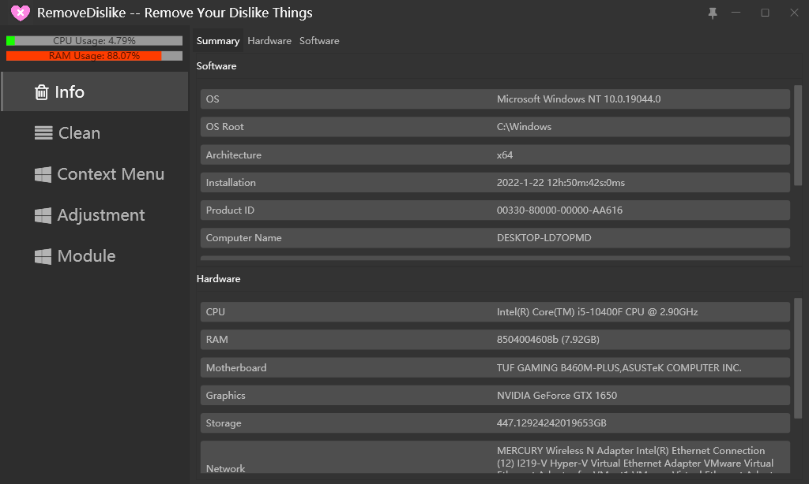
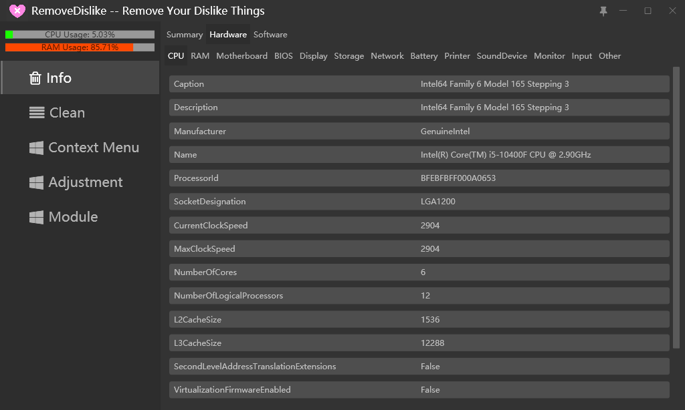
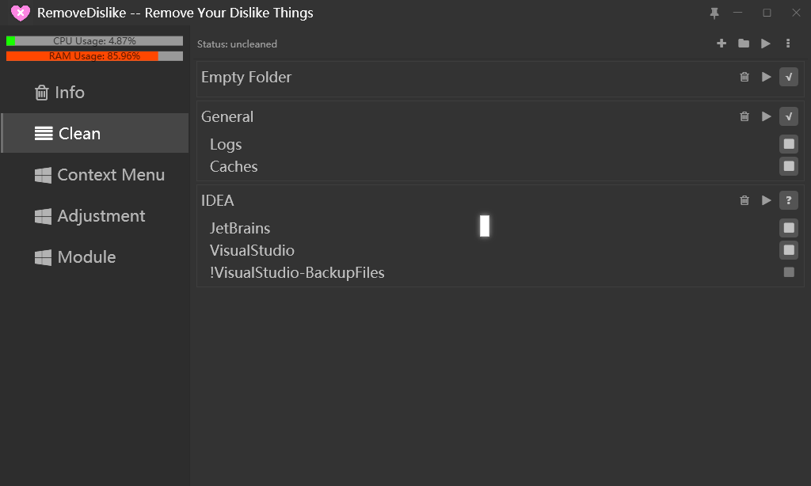
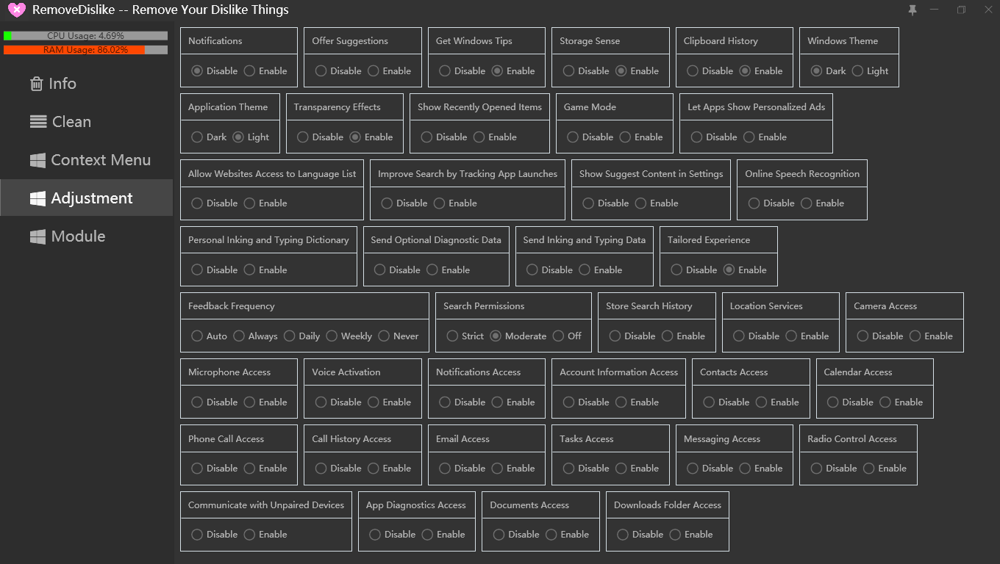

# RemoveDislike

Remove Your Dislike Things  [Releases](https://github.com/Yuhanawa/RemoveDislike/releases)
Originally a junk cleaner, And now it's a less practical computer tool
The software is almost complete and will continue to be updated if I have time.
***Of course, PR is welcome!***

---
##  Screenshots





## External Rules
The Rules base directory : ` %AppData%\RemoveDislike\Rules\` [Online Rules](https://gist.github.com/Yuhanawa/9e9a0e9f38e20710f68973daa2fe7418)
File Name: `Rule Name @ Author.json` or `Rule Name.json`
```json
{
    "description": "include logs, caches, temp and !BackupFiles",
    "danger": false, // Support Comments
    "rules": {
        "Category name (starts with ! is danger and is not automatically selected)": {
            "/**/{log,caches,tmp,temp}/**": [  // Ant-style path patterns
                "%APPDATA%/../"  // Target path (environment variables supported)
            ]
        },
        "!danger": {
            "/**/BackupFiles/**": [
                "%APPDATA%/../Local/Microsoft/VisualStudio/",
                "%APPDATA%/../Local/Microsoft/Blend/"
            ]
        }
    }
}

```

